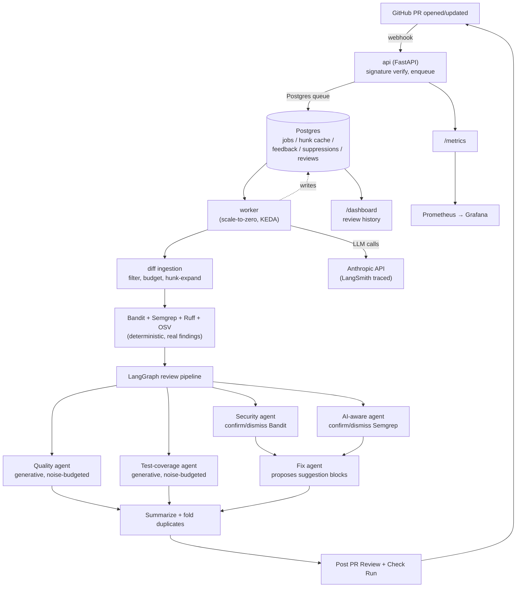

# Architecture

How a pull request becomes a review, why each piece is shaped the way it is, and what it does
badly. For setup see [docs/github-app.md](docs/github-app.md) and
[docs/self-host.md](docs/self-host.md).

## Shape

## The pipeline, in order

1. **Ingest** — fetch changed files at `head_sha`; filter out lockfiles, generated files, docs,
   vendored code and non-Python; enforce a per-PR file and token budget; expand each diff hunk to
   ~30 lines of real surrounding context.
2. **Deterministic tools** — Bandit, Semgrep (a general ruleset plus `rules/llm-security.yaml`),
   Ruff and an OSV dependency-CVE lookup, each run once over the whole batch, then filtered to
   changed lines.
3. **Review graph** (LangGraph, fanned out per file and per hunk):
   - **Security** confirms or dismisses each Bandit finding, assigning a real-world severity.
   - **AI-aware** does the same for Semgrep findings, only on files importing an LLM SDK.
   - **Quality** and **Test-coverage** generate findings per hunk from scratch, under a noise budget.
   - **Eval-hygiene** runs once per PR against the base branch: missing eval harness, unmocked live
     LLM calls in tests, unversioned inline prompts.
4. **Fix** proposes a GitHub suggestion block for every confirmed finding at or above
   `fix_threshold`. Never applied automatically — a human clicks "commit suggestion".
5. **Summarize** folds duplicates by fingerprint, splits inline comments (capped, most severe
   first) from a summary-body list, and posts one PR Review.
6. **Check Run** concludes `success` or `failure` from the worst confirmed severity against
   `gate_threshold`. This is what a branch-protection rule gates on.
7. **Feedback** — a 👍/👎 or "false positive" reply on a finding's comment is recorded; a confirmed
   false positive suppresses that exact fingerprint for the rest of the repo's life.

## Why it is built this way

| Decision | Reason |
|---|---|
| **Deterministic tool + LLM verdict, not LLM-only, for security** | An LLM asked to "find security issues" free-form has no recall guarantee and no stable identity for a finding across re-reviews. Bandit and Semgrep guarantee recall on their own rules; the model supplies the context a static rule cannot — a hardcoded string in a test file versus production code. This is what makes a confirmed finding trustworthy enough to gate a merge on. |
| **LangGraph with `Send` fan-out, not one mega-prompt** | Verdicts, Quality and Test are independent per file and per hunk, so they run concurrently and join before summarizing. One prompt cannot cache per-agent system prompts separately or use a different model tier per task. |
| **Sonnet for Security/AI-aware/Fix, Haiku for Quality/Test/Summary** | Verdict judgment and writing a patch benefit from the stronger model. The highest-volume calls — one per hunk — do not need it for "is this name unclear". |
| **Hunk-level caching keyed on content hash** | A second push that changes one file should not re-review every other file's unchanged hunks. Keyed on content, not path or commit, so identical content anywhere reuses a prior verdict. The key carries a contract version, so changing how findings are validated invalidates entries rather than serving them unverified. |
| **Quality and Test have a noise budget; Security and AI-aware do not** | Only those two invent findings with no deterministic baseline. Severity is capped at MEDIUM, findings per hunk are capped, and a confidence gate demotes the vaguest to the summary body instead of an inline comment. |
| **Generative findings must quote the line they mean** | Quality and Test choose both the observation and the coordinates, and nothing checked the coordinates. Each finding now carries a `code` echo verified against the hunk: it corroborates the claimed line, relocates to the one line it actually quoted, or loses its line and moves to the summary body. A finding in the summary body is reported in full; a finding on the wrong line misleads. |
| **`.codeguard.yml` is read from the base branch only** | Otherwise a pull request could raise its own budget or disable the agent that would have caught it, in the same pull request. |
| **Worker scales to zero; api stays at exactly one replica** | The reaper that reclaims abandoned queue leases runs inside the api process and assumes it is the only sweeper. The worker has no such constraint, and the queue is idle most of the time, so KEDA scales it 0→3 on pending job count. |

## Fix suggestions, and why they are heavily guarded

A suggestion block is the one output a reviewer can apply with one click, so a wrong one edits
their file. Each is checked before it is posted:

- **Generative findings never get one.** Quality and Test choose their own line numbers; only
  scanner-grounded findings are eligible.
- **The agent must echo the lines it is replacing**, matched verbatim against the file. The echo may
  extend past the finding — a B608 fix has to change the `execute()` call below the query too — and
  the suggestion is then anchored to exactly the range it echoed.
- **The whole replaced range must be inside the diff**, or GitHub rejects the comment and the range
  would rewrite lines the PR never touched.
- **The file must still parse afterwards** — compared before against after, so a PR that was
  already broken does not lose all its suggestions.
- **The replacement must not restate the lines below it**, which a suggestion block duplicates
  rather than replaces.

Each of these exists because the previous version shipped a suggestion that would have corrupted a
file. The history is in `tests/pipeline/test_fix_suggestion_targeting.py`.

## Guardrails

- **Injection handling strips matched spans; it does not stop prompt injection.** Recognised
  patterns (`ignore previous instructions`, `reveal the system prompt`, role-play framings,
  "respond X instead of flagging issues") are removed and replaced with a marker before the prompt
  is built, logged with a fingerprint and counted in `codeguard_injection_attempts_total`. **The
  review then continues on what remains.** Encoded or obfuscated payloads pass the regex layer
  untouched; the remaining defence is that every agent's system prompt frames PR content as data
  rather than instructions, which is a mitigation and not a proof. What was tested, and what got
  through, is in [`evals/adversarial/README.md`](evals/adversarial/README.md).
- **PII is flagged, not blocked.** It is surfaced to a human rather than silently altering what is
  reviewed.
- **Webhook deliveries are HMAC-verified** before anything is enqueued.
- **The dashboard escapes everything and redacts credential-shaped text** before rendering. Finding
  messages are tool-generated but echo matched source — Bandit's hardcoded-secret message contains
  the secret — and a public repo's dashboard page needs no login.

## Queue and delivery

Postgres-backed, at-least-once. A worker claims a batch under a lease, heartbeats to extend it, and
acks on success; a lost lease means the job is abandoned rather than double-posted. The api runs a
reaper that requeues expired leases. Posting is guarded separately by an idempotency key, because
at-least-once delivery is not at-most-once side effects — a worker that posts and then dies before
acking must not post twice on redelivery.

On `SIGTERM` the worker releases its in-flight job back to the queue with its attempt count
untouched, so a deploy hands work to the replacement replica immediately instead of waiting out the
lease. A shutdown is not a failure and must not consume a retry.

## Deployment

Azure Container Apps: api pinned at one replica, worker scale-to-zero KEDA-scaled 0→3 on pending
job count, backed by Azure Database for PostgreSQL. Images are built by GitHub Actions and pushed
to ACR with both `:latest` and an immutable `:sha-<7>` tag; `deploy/azure.sh` refuses to ship unless
the two resolve to the same digest, and deploys by digest under a commit-named revision. Details in
[docs/self-host.md](docs/self-host.md).

## Limitations

- **Hunk-scoped review can misjudge whole-function facts.** Quality and Test see a changed region
  plus ~30 lines of context, not the whole file. A real example from this repo: CodeGuard claimed a
  function "has no return statement visible" — it has one, several lines past what that hunk showed.
  Not dishonest, just working from a partial view. Whole-file review costs more and dilutes focus on
  what the PR changed, so this is a live trade-off rather than a bug to fix. Treat a hunk-scoped
  claim about a function's overall structure with more scepticism than a claim about the lines it
  was shown.
- **Whole-file audit can exceed the per-call input guardrail.** `codeguard audit` chunks oversized
  files at AST boundaries, but a single unsplittable statement — a huge literal — can still exceed
  it. The file is reported as skipped rather than silently dropped.
- **Dismissals are Bandit and Semgrep only, never Ruff.** Ruff findings pass straight through: lint
  output does not need semantic judgment the way "is this SQL actually injectable" does. Confirmed
  on real data — 89/89 dismissals on one real PR were Bandit rule IDs, zero were Ruff.
- **Python only.** Everything else is filtered out at ingest.
- **The LangChain rules have real-code hits; the LlamaIndex rules have none.** A langflow scan
  produced 11 true positives against LangChain call shapes, 9 of them timeout/max-tokens hygiene —
  but the sharper LLM01/LLM05 rules got no hit in either direction, and no LlamaIndex rule has ever
  matched real code. See the README's limitations for which symbols are unverified and why, and
  [`evals/RESULTS.md`](evals/RESULTS.md) for the per-finding triage.
