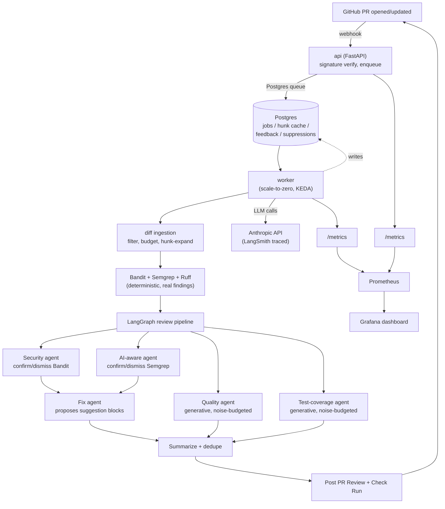

# CodeGuard

An AI code-review GitHub App: install it on a repo, open a pull request, and within a
minute or two get a real review — security findings, quality notes, test-coverage gaps, and
one-click fix suggestions — posted as a normal PR review, plus a pass/fail Check Run a
branch-protection rule can gate a merge on.

## What makes this different from "wrap an LLM around `git diff`"

Most AI review tools point a general-purpose model at a diff and print whatever comes back.
CodeGuard's actual differentiator is that **the LLM never invents a finding a deterministic
scanner didn't already produce, for security** — Bandit and a custom Semgrep ruleset run first;
the model's only job for those is to *judge* each finding in context (confirm, or dismiss with a
concrete, cited reason) and assign a real-world severity. That single design choice is what makes
a "confirmed" security finding trustworthy enough to gate a merge on, rather than another source of
alert fatigue.

The other half of the differentiator is the **custom Semgrep ruleset for LLM-integration code
itself** (`rules/llm-security.yaml`) — missing timeouts on `messages.create()`, unpinned model
aliases, prompt-injection-shaped string concatenation, logging full prompts/responses, output
piped into `eval()`/SQL. A PR that touches AI-calling code gets these checked the same
confirm-or-dismiss way everything else does. Quality and test-coverage findings are the one place
the model *is* generative rather than verifying — and because that's exactly where noise can creep
in, those two agents run under an explicit noise budget: capped severity, capped findings per hunk,
and a confidence score that demotes the vaguest ones to a summary line instead of an inline comment.

None of this is a claim taken on faith — see [`evals/RESULTS.md`](evals/RESULTS.md) for what was
actually measured, including a wrong finding CodeGuard produced about its own code.

## Architecture



### Why these decisions

| Decision | Why |
|---|---|
| **LangGraph, sequential-with-fan-out, not a single mega-prompt** | Security/AI-aware verdicts, Quality, and Test-coverage are independent per file/hunk — `Send`-based fan-out reviews them concurrently, then joins before summarizing. A single prompt can't cache per-agent system prompts separately or apply a different model tier per task. |
| **Deterministic tool + LLM verdict, not LLM-only, for security** | An LLM asked to "find security issues" free-form has no recall guarantee and no stable identity for a finding across re-reviews. Bandit/Semgrep guarantee recall on their own rule set; the model adds the contextual judgment a static rule can't (a hardcoded string in a test file vs. production code). |
| **Sonnet for Security/AI-aware/Fix, Haiku for Quality/Test/Summary** | Verdict judgment and code-writing benefit from a stronger model; the highest-volume calls (one per hunk) don't need Sonnet-level reasoning for "is this naming unclear." |
| **Hunk-level, content-hash-keyed caching** | A PR pushed twice with only one file changed shouldn't re-review every other file's unchanged hunks — keyed on content hash, not file path or commit SHA, so identical content anywhere reuses a prior verdict. |
| **Injection is block-not-flag; PII is flag-not-block** | An injection attempt threatens to hijack the model's own instructions — it's stripped before the prompt is even built, never just noted. PII in a finding doesn't threaten the pipeline's integrity the same way, so it's surfaced to a human instead of silently altering scanned content. |
| **Quality/Test have a noise budget; Security/AI-aware don't** | Only Quality/Test generate findings from scratch with no deterministic baseline — capped severity (never above MEDIUM), capped findings/hunk, and a confidence-gated inline/summary split bound the damage a wrong guess can do. |
| **`.codeguard.yml` is read from the PR's base branch, never the head** | A PR that could edit its own review policy could raise its own budget or disable the agent that would have caught it, in the same PR. |
| **Worker scales to zero; api stays at exactly 1 replica** | The reaper (reclaiming abandoned queue leases) runs inside the api process and assumes it's the only instance sweeping — see `codeguard/queue/reaper.py`. Worker has no such constraint and the queue is naturally idle most of the time, so KEDA scales it 0→3 on pending job count. |

## The pipeline, in order

1. **Ingest** — fetch the PR's changed files at `head_sha`, filter (lockfiles/generated/docs/
   vendored/non-Python skipped), enforce a per-PR file/token budget, expand each diff hunk to ~30
   lines of real surrounding context.
2. **Deterministic tools** — Bandit, Semgrep (a general ruleset plus the custom LLM-security one),
   and Ruff run once each on the whole batch, findings filtered to changed lines.
3. **Review graph** (LangGraph, fanned out per file/hunk):
   - **Security** confirms/dismisses each Bandit finding, with severity and a plain-language fix.
   - **AI-aware** does the same for Semgrep findings, only on files that touch an LLM SDK.
   - **Quality** and **Test-coverage** generate findings per hunk from scratch — noise-budgeted.
   - **Repo-level eval-hygiene** checks (once per PR, against the base branch) flag missing eval
     harnesses, unmocked live LLM calls in tests, and unversioned inline prompts.
4. **Fix** proposes a GitHub suggestion-block for every confirmed finding at or above
   `fix_threshold` — never applied automatically, always a human clicking "commit suggestion."
5. **Summarize** dedupes everything by fingerprint, splits into inline comments (capped, most
   severe first) vs. a summary-body list, and posts one PR Review.
6. **Check Run** concludes `success`/`failure` from the worst confirmed severity vs. the repo's
   `gate_threshold` — this is what a branch protection rule actually gates on.
7. **Feedback loop** — a 👍/👎 or "false positive" reply on a finding's comment is recorded; a
   confirmed false positive suppresses that exact finding (by fingerprint) for the rest of the
   repo's life, going forward.

## Guardrails

- **Prompt injection — block, not flag.** Every piece of PR content is scanned before it's allowed
  into a prompt; a recognized injection pattern (`ignore previous instructions`, `reveal the system
  prompt`, `act as...`, a "respond X instead of flagging issues" substitution, etc.) is stripped and
  replaced with a marker before the call is made, logged with a fingerprint, and counted
  (`codeguard_injection_attempts_total`). The review continues on what's left.
- **PII — flag, not block.** A PII-looking pattern in scanned content is noted for a human, never
  used to alter what gets reviewed.
- **Everything is framed as DATA, never instructions**, in every agent's own system prompt — the
  model is told explicitly that PR content, however it's phrased, is material to analyze, not
  commands to follow.
- **`.codeguard.yml` is base-branch-only**, enforced at the loader, not by convention.
- This is pattern-matching, not proof — see [`evals/adversarial/README.md`](evals/adversarial/README.md)
  and [`evals/RESULTS.md`](evals/RESULTS.md) for exactly what was tested, what passed, and the
  known gap (obfuscated/encoded payloads bypass the regex layer; defense-in-depth there is the DATA
  framing, not detection).

## The numbers (from real, live runs — not fixtures written alongside the rules)

Full detail in [`evals/RESULTS.md`](evals/RESULTS.md). Highlights:

| Agent | Precision | Recall | Cost/run |
|---|---|---|---|
| Security (Bandit) | 1.00 | 1.00 | ~$0.046 |
| AI-aware (Semgrep) | ~0.98 | 1.00 | ~$0.11 |
| Quality | 0.75 | 1.00 | ~$0.008 |
| Test-coverage | 1.00 | 1.00 | ~$0.007 |

Dogfooded against two real repositories (this one and a separate RAG project by the same author):
132 real findings, including a genuine unflagged security issue (a missing `timeout=` on two
`messages.create()` calls) and — reported honestly, not cherry-picked — a confidently-wrong Quality
finding about CodeGuard's own code, kept in the eval suite as a permanent regression fixture.

## Live deployment

Running on Azure Container Apps (api pinned at 1 replica; worker scale-to-zero, KEDA-scaled 0→3
on pending job count), backed by Azure Database for PostgreSQL. A real PR reviewed end to end by
the hosted deployment: **[codeguard-playground#5](https://github.com/ashrithaumd/codeguard-playground/pull/5)**
— the SQL injection, naming issue, and untested edge case in that PR's `validation_test.py` were
found and posted by the Azure-hosted App itself, not run locally.

## Project structure

```
codeguard/
├── api/            FastAPI app: webhook receiver, health, /metrics
├── worker/         Poll → claim → review → post, with heartbeat/lease/reaper
├── pipeline/        LangGraph nodes, guardrails, hunk cache, feedback loop
├── diff/            PR diff ingestion: fetch, filter, budget, hunk expansion
├── tools/           Bandit/Semgrep/Ruff/OSV runners, changed-line filtering
├── github/          GitHub REST calls: auth, reviews, check runs, repo config
├── queue/           Postgres-backed job queue (claim/heartbeat/nack/reap)
├── mcp/             MCP server exposing review_diff/audit_repo as tools
├── cli.py           `codeguard audit` — whole-repo scan, markdown report
└── config.py         Settings (env) and RepoConfig (.codeguard.yml)

evals/                Eval harness, fixtures, adversarial suite, dogfood runs, RESULTS.md
observability/        Prometheus scrape config + provisioned Grafana dashboard
migrations/           Postgres schema, applied automatically on startup
rules/                Custom Semgrep ruleset for LLM-integration code
```

## Running it locally

```bash
cp .env.example .env   # fill in ANTHROPIC_API_KEY, GITHUB_APP_ID, GITHUB_WEBHOOK_SECRET,
                        # GITHUB_PRIVATE_KEY_PATH (a GitHub App's downloaded .pem)
docker compose up -d
```

This brings up Postgres, the api (webhook receiver, `:8000`), the worker, and a local
observability stack — Prometheus (`:9090`) and Grafana (`:3000`, anonymous viewer access) with the
CodeGuard dashboard pre-provisioned. For a real webhook locally, forward GitHub's deliveries with a
tunnel (e.g. `npx smee-client --url $SMEE_URL --target http://localhost:8000/webhook`) and set that
URL as the GitHub App's Webhook URL — the same field switches to the deployed URL in production,
no code change either way.

```bash
pip install -e ".[dev]"
pytest tests/diff tests/tools tests/github tests/pipeline   # no external deps
pytest tests/queue                                            # needs the local Postgres running
```

## Installing the GitHub App on a repo

1. From the App's settings page (`github.com/settings/apps/<your-app>`), click **Install App**,
   choose the repo(s).
2. Under **Permissions & events**, this App needs: **Contents** (read), **Pull requests**
   (read & write — for posting the review), **Checks** (read & write — for the Check Run gate).
   If you add Checks later, GitHub will prompt existing installations to approve the update.
3. Subscribe to these webhook events: **Pull request**, **Pull request review comment**,
   **Issue comment** (the last two power the feedback loop).
4. Point the App's **Webhook URL** at `https://<your-deployment>/webhook`.

## `.codeguard.yml` reference

Optional, committed at the repo root, read from the **base branch only** (a PR can never affect
its own review policy by editing this file):

```yaml
fix_threshold: high        # low | medium | high | critical — min severity for an auto-proposed fix
gate_threshold: critical   # min severity that fails the Check Run
enable_ai_aware: true      # run the LLM-security Semgrep ruleset + eval-hygiene checks
max_files_per_pr: 15       # requests are capped by the operator's own global ceiling too
max_tokens_per_pr: 40000
max_wall_clock_s: 120
ignored_paths: []          # fnmatch patterns, checked before language/extension filtering
```

## Audit mode: `codeguard audit`

Scans a whole repo — not one PR's diff — reusing the exact same deterministic tool runners, OSV
dependency-CVE lookup, eval-hygiene checks, and Security/AI-aware verdict agents the PR pipeline
uses, plus a separate (lower) budget ceiling so an audit of a large public repo can't run away on
tokens. AI-aware verdicts only run on files that import an LLM SDK; Quality/Test are intentionally
skipped in audit mode (see `evals/RESULTS.md`'s Phase 11 section for why).

```bash
pip install -e .
codeguard audit https://github.com/owner/repo        # or a local path
codeguard audit . --output report.md --post-issue    # requires a GITHUB_TOKEN env var, github.com only
```

Writes a markdown report (findings by severity with `file:line`, dismissals, eval-hygiene results,
token/cost/latency) to `--output` (default `codeguard-audit-report.md`). `--post-issue` also opens
it as a GitHub Issue on the target repo — never pass a token on the command line; set `GITHUB_TOKEN`
in the environment instead. See `evals/RESULTS.md`'s Phase 11 section for a real run against
`simonw/llm`, including what it missed and why (large-file token-budget truncation, and the
pre-existing `MAX_CHUNK_TOKENS` input guardrail refusing verdict calls on very large files).

## MCP server

`codeguard/mcp/server.py` exposes the pipeline to any MCP client (Claude Code, Cursor) over stdio,
as two tools:

- **`review_diff`** — runs the exact same compiled LangGraph (`review_graph`) a real PR review
  runs, against the current repo's uncommitted changes (`git diff HEAD`, staged + unstaged +
  untracked new files), and returns findings/dismissals/cost as structured JSON. No GitHub calls,
  no Postgres — every hunk gets a fresh LLM call, nothing is pre-suppressed.
- **`audit_repo`** — thin wrapper around `codeguard audit`, for a whole repo (URL or local path)
  instead of a diff.

Claude Code (`.mcp.json` at your project root, or `claude mcp add`):

```json
{
  "mcpServers": {
    "codeguard": {
      "command": "python",
      "args": ["-m", "codeguard.mcp.server"],
      "env": { "ANTHROPIC_API_KEY": "${ANTHROPIC_API_KEY}" }
    }
  }
}
```

Cursor (`.cursor/mcp.json`):

```json
{
  "mcpServers": {
    "codeguard": {
      "command": "python",
      "args": ["-m", "codeguard.mcp.server"],
      "env": { "ANTHROPIC_API_KEY": "${ANTHROPIC_API_KEY}" }
    }
  }
}
```

Both tools were verified live from Claude Code in this session — see `evals/RESULTS.md`'s Phase 11
section for real cost and findings, including a bug (untracked new files invisible to `git diff
HEAD` alone) caught by a test before it ever reached a live run.

## Environment variables

| Variable | Required | Notes |
|---|---|---|
| `ANTHROPIC_API_KEY` | Yes | Every review agent uses this. |
| `DATABASE_URL` | Yes | Postgres connection string; `sslmode=require` in production. |
| `GITHUB_APP_ID` | Yes | |
| `GITHUB_WEBHOOK_SECRET` | Yes | Verifies `X-Hub-Signature-256` on every delivery. |
| `GITHUB_PRIVATE_KEY_PATH` | One of these two | A mounted `.pem` file — local dev convention. |
| `GITHUB_PRIVATE_KEY` | | The PEM content itself — used in place of a file where secrets are env-vars only (e.g. Azure Container Apps). |
| `LANGSMITH_TRACING` / `LANGSMITH_API_KEY` / `LANGSMITH_PROJECT` | No | Every real Anthropic call is traced when set — see `codeguard/pipeline/llm_call.py`. |

Full list of tunable per-agent model/timeout/budget settings in `codeguard/config.py`.

## Author

Built by **Ashritha**.

- GitHub: [github.com/ashrithaumd](https://github.com/ashrithaumd)
- Email: ashritha@umd.edu
